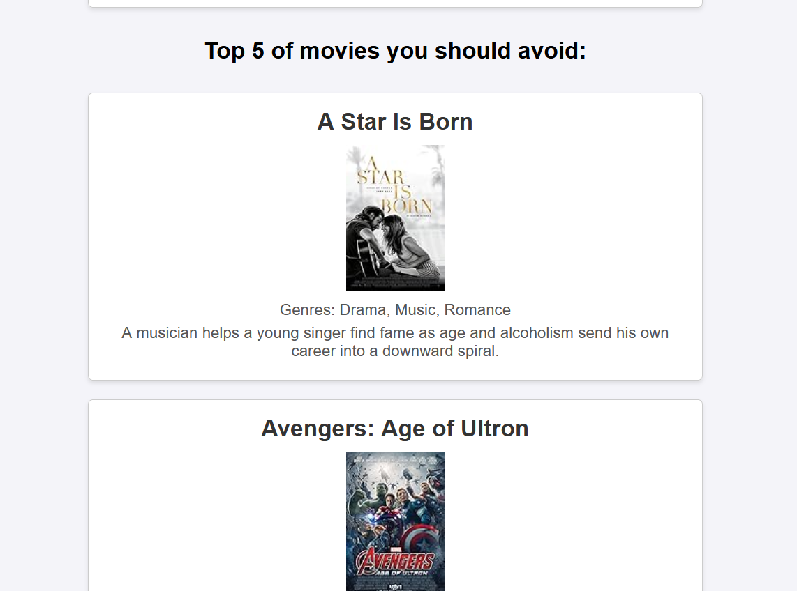
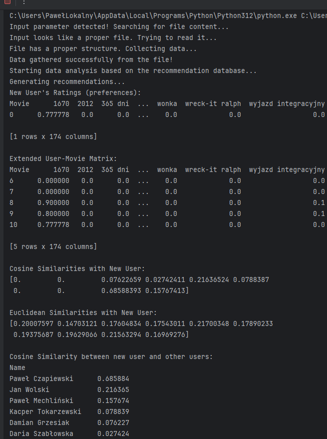
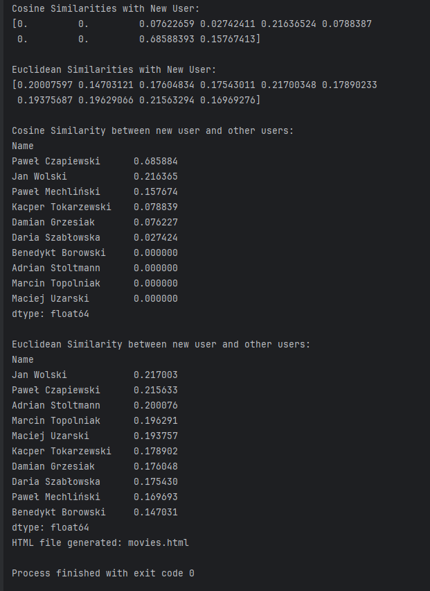
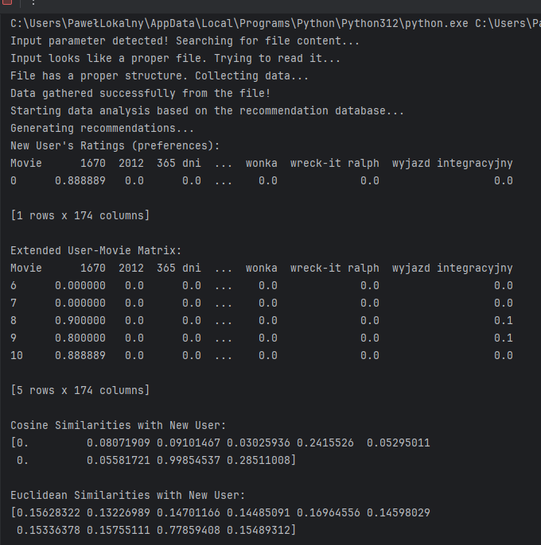
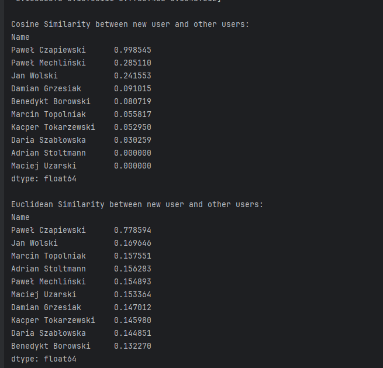
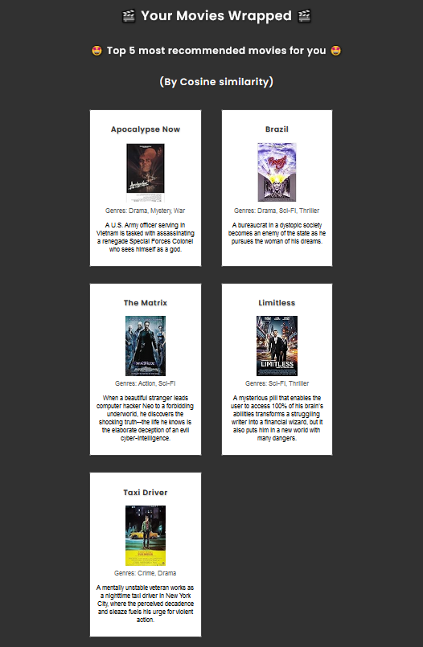
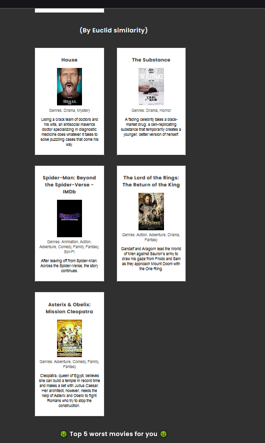
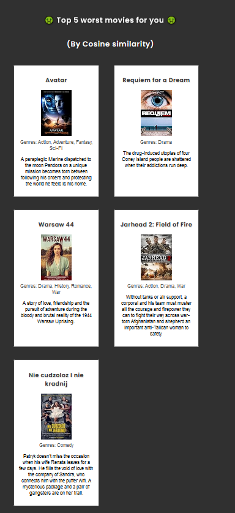
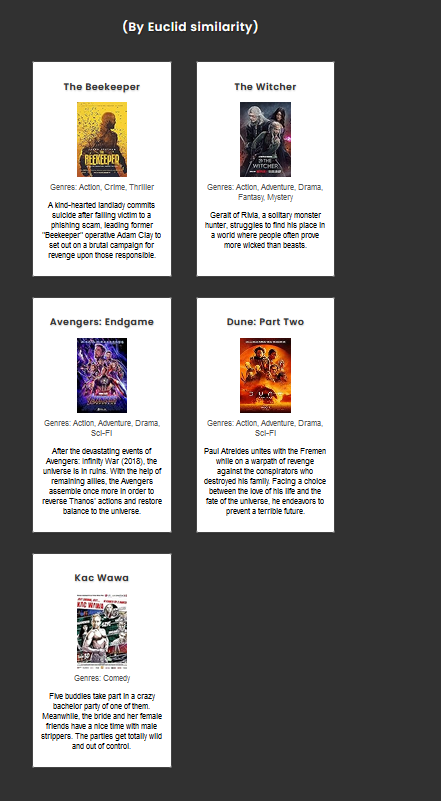
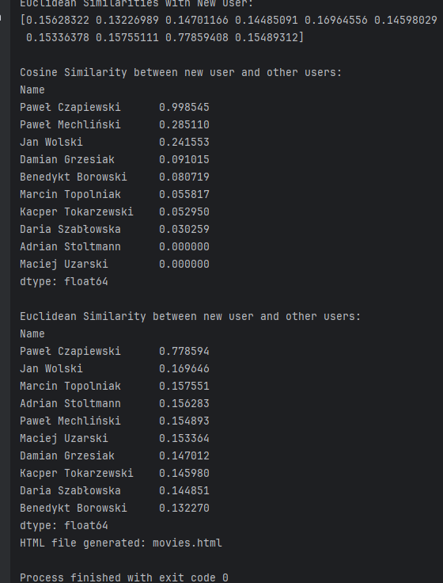

'NARZEDZIA SZTUCZNEJ INTELIGENCJI' 2024/2025

# Introduction

## Problem description
Due to professor's request we need to create a recommendation engine for the most interesting movies so that we won't fail the subject. In today's era of digital streaming, every user can be overwhelmed by the volume of movies available across many platforms and services. Those platform and services require recommendation systems to enhance user satisfaction and engagement by providing personalized movie suggestions.

## Authors
Mateusz Wróbel - head of engineering, machine learning engineer team lead

Paweł Mechliński - lead data analyst, junior UI Engineer & technical writer associate

## How to use
There are two ways one interact with the application:
1. Start main.py without any parameters - you will be prompted to fill the list of your watched movies and scores for them.
2. Start main.py setting up as a parameter a .csv file - file should have columns named 'movie' with movie titles and 'score' with score in a form of a number from 0 to 1 by a step of 0.1 (so 0.1, 0.2, ... up to 1.0).

In both cases, the engine will analyze the input data and correlate them with the training database to provide best and worst movie recommendations.

## Screenshots

### Early tests

> _(Screenshots picture the UI evolution, but at the stage of frontend design, there were no changes made in the recommendation engine itself - so the differences are purely cosmetic)_
 
### Improved UI

> _Improved UI includes some CSS animated elements and AI generated logo for the application._

### Similarity scores
#### Similarity metrics calculated for random User ratings set:

> _For users with no common ratings, the similarity is 0._

#### Similiarity metrics calculated for Professor's scores set:

> _We can see that there is the biggest similarity for the original user's ratings which confirms that the algorithm works (somewhat) as expected._ 

### Similarity in UI - professor's recommendations

> _Here we can see that difference in results obtained from the use of both methods of similarity comparison yields different movie recommendations for the same input dataset (in this case, Professor's movie ratings)_

## Checkpoints before sending next homework
- [x] Create recommendation engine.
- [x] Suggest top 5 & 5 worst recommendations for the user.
- [x] Include file with data used for training the engine.
- [x] No commented code.
- [x] Don't push .idea env files.
- [x] Include requirements.txt (imported from the PyCharm).
- [x] Keep langauge consistency - all vars, comments etc. in English.
- [x] Keep all exercises in one repository (use different branches).
- [x] Add screenshot from the run of the project.
